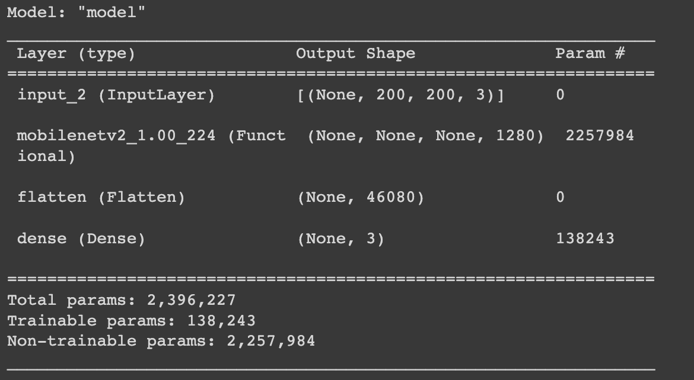
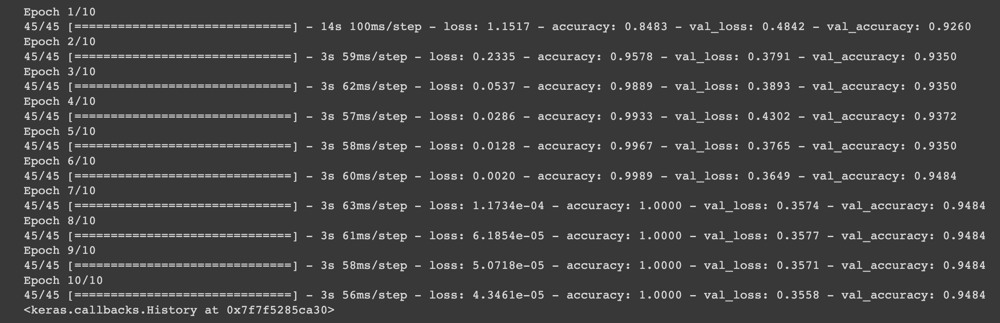
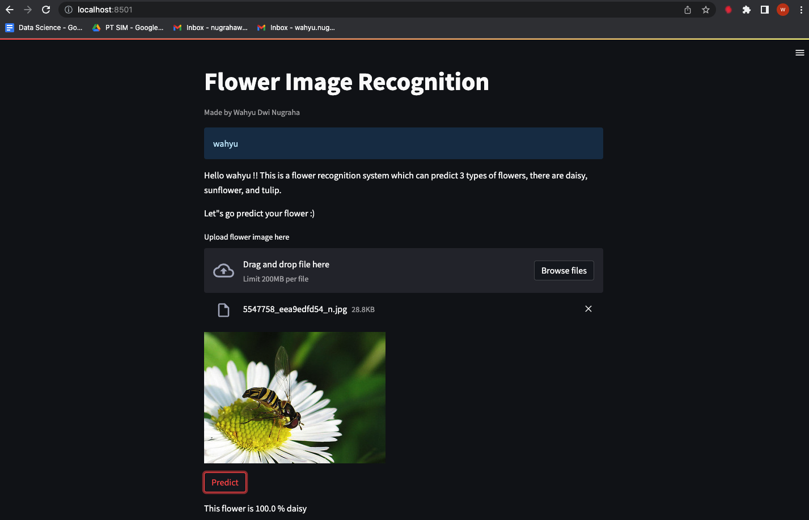

# **Flower-Classification**
Made by Wahyu Dwi Nugraha

## **Project Goal**
This is image recognition project to classify 3 types flower image, daisy, sunflower, and tulip.

## **Step of Work**
#### **1. Data Extraction**
For this project, i use tensorflow flower open source dataset. There 5 types of flower in tensorflow flower dataset, but i only use 3 types of flower.

#### **2. Data Preprocessing**
In this step, first i try to visualize image data with PIL library. After that, image data path store in dataframe with label of each flower. Image data were loaded with keras img_load and those images convert into array of number (this is useful because neural network only process number).

#### **3. Modelling**
In this step, deep learning model has been created with transfer learning method. I used mobilenetV2 as a model with this model summary.

I trained this model with only 10 epochs and got very good result in training and validation accuracy. Here i attach training and validation accuracy of model.

#### **4. Deployment**
In this deployment step, first i try to build simple dashboard with streamlit library. Then, i deploy my final dashboard to streamlit cloud.

Link to deployed app: [Flower Classification](https://flower-classification.streamlit.app/)

***note: if app can't open, contact me***

Here i also attach dashboard visualization of flower classification.

